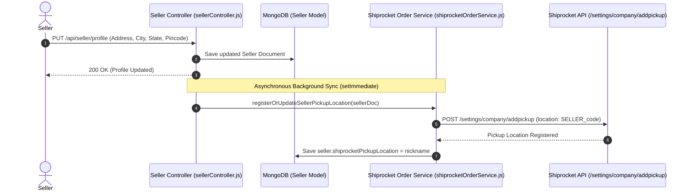
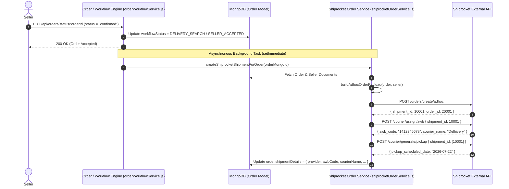
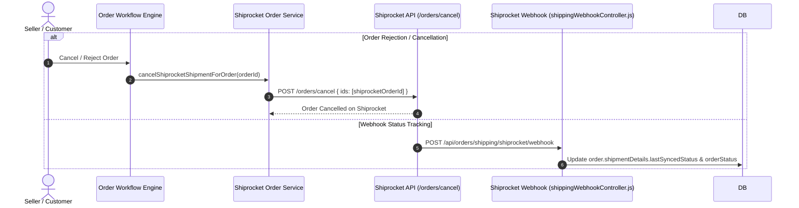

# 🚀 Shiprocket Integration & Order Lifecycle Workflow

This document provides a comprehensive technical breakdown, sequence diagrams, data mapping, and step-by-step operational guide for the **Shiprocket Integration** within the Seva Fast application.

---

## 📌 Overview of Integration

The Shiprocket integration handles two primary automated processes:

1. **Seller Pickup Address Synchronization**:
   - When a seller updates their store address or profile, the system automatically registers or updates a dedicated **Pickup Location** in Shiprocket using the seller's unique code or ID as the nickname.

2. **Automated Shipment Creation upon Order Acceptance**:
   - As soon as a seller accepts an incoming order (`sellerAcceptAtomic`), the system automatically:
     - Constructs an adhoc order payload containing item details, pricing, customer address, and seller's pickup location nickname.
     - Calls Shiprocket API (`POST /orders/create/adhoc`).
     - Auto-assigns an AWB (courier partner) to the shipment (`POST /courier/assign/awb`).
     - Schedules pickup with the courier (`POST /courier/generate/pickup`).
     - Persists all shipment metadata (`shipmentDetails`) directly on the `Order` model in MongoDB.
   - If a seller subsequently cancels or rejects the order, the system automatically triggers a cancellation request to Shiprocket (`POST /orders/cancel`).

---

## 🔄 End-to-End Workflow Diagrams

### 1. Seller Address Sync Flow



---

### 2. Order Acceptance & Automatic Shipment Creation



---

### 3. Order Cancellation & Webhook Tracking



---

## 📊 Data Schema Mapping

### 1. `Seller` Model Extension
File: `backend/app/models/seller.js`
```javascript
{
  shiprocketPickupLocation: {
    type: String,
    trim: true,
    // Holds the unique pickup nickname registered on Shiprocket (e.g. "SV_STORE123")
  }
}
```

### 2. `Order` Model (`shipmentDetails`)
File: `backend/app/models/order.js`
```javascript
{
  shipmentDetails: {
    provider: "shiprocket",
    shiprocketOrderId: 20001234,
    shiprocketShipmentId: 10005678,
    awbCode: "141234567890",
    courierName: "Delhivery Surface",
    awbAssigned: true,
    pickupScheduled: true,
    pickupTokenNumber: "2026-07-22 10:00",
    lastSyncedStatus: "OUT FOR DELIVERY",
    lastError: null,
    createdAt: Date
  }
}
```

---

## 🛠 File Structure & Code Responsibilities

| File Path | Primary Responsibility |
|---|---|
| `backend/app/services/shiprocket/shiprocketService.js` | Low-level Axios HTTP client for Shiprocket API authentication (`/auth/login`), adhoc order creation, AWB assignment, pickup generation, label creation, and pickup location registration (`/settings/company/addpickup`). |
| `backend/app/services/shiprocket/shiprocketOrderService.js` | Higher-level Mongoose orchestrator. Contains `registerOrUpdateSellerPickupLocation`, `buildAdhocOrderPayload`, `createShiprocketShipmentForOrder`, and `cancelShiprocketShipmentForOrder`. |
| `backend/app/controller/sellerController.js` | Updates seller profile address and triggers background registration of Shiprocket pickup location (`registerOrUpdateSellerPickupLocation`). |
| `backend/app/services/orderWorkflowService.js` | Manages atomic order status transitions (`sellerAcceptAtomic`, `sellerRejectAtomic`). Triggers automatic Shiprocket shipment creation upon seller acceptance. |
| `backend/app/controller/shippingWebhookController.js` | Webhook controller receiving real-time shipment status updates (AWB status, tracking, delivery confirmation) from Shiprocket. |

---

## ⚙️ Environment Variables Required

Add these variables to your `.env` file:

```env
SHIPROCKET_EMAIL=your_shiprocket_email@example.com
SHIPROCKET_PASSWORD=your_shiprocket_password
SHIPROCKET_PICKUP_LOCATION=Primary
SHIPROCKET_CHANNEL_ID=
SHIPROCKET_WEBHOOK_SECRET=your_shiprocket_webhook_secret
```

---

## 🧪 Testing with Postman

Import the Postman Collection file provided in the repository:
`postman_shiprocket_integration_collection.json`

### Workflow Execution Order in Postman:
1. **1. Auth - Seller Login**: Authenticates seller and stores `sellerToken`.
2. **2. Auth - Customer Login**: Authenticates customer and stores `customerToken`.
3. **3. Seller - Update Profile**: Updates address and syncs store pickup location to Shiprocket.
4. **4. Customer - Place Order**: Places a new order and stores `orderId`.
5. **5. Seller - Accept Order**: Triggers automatic Shiprocket order creation, AWB assignment & pickup scheduling.
6. **6. Order - Get Order Details**: Inspect `shipmentDetails` object on the response.
7. **7. Seller - Reject / Cancel Order**: Verifies automatic shipment cancellation on Shiprocket.
